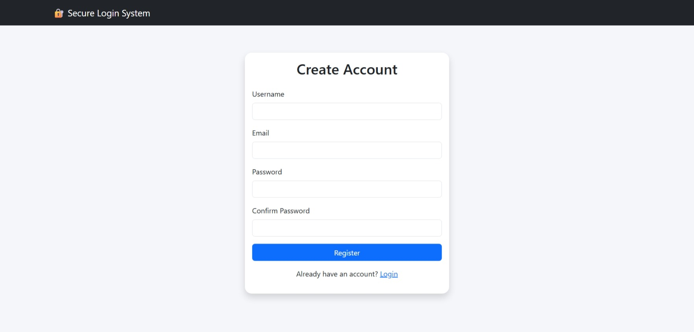
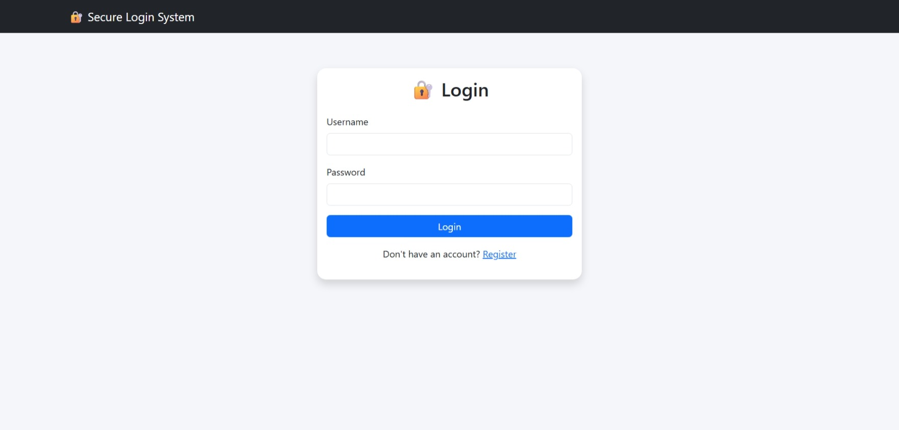

# Thiranex_secure_login_system

A simple and secure **Login and Registration System** developed using **Python Flask, HTML, CSS, and SQLite**.

This project allows users to create an account, log in with their registered details, and access a protected dashboard after successful authentication.

## Features

- User registration
- User login
- Username/email and password validation
- Protected dashboard
- Session-based login
- Logout option
- SQLite database for storing user details
- Simple and responsive user interface
- Environment variables using `.env`
- Separate HTML templates and CSS file

## Technologies Used

- **Python** – Main programming language
- **Flask** – Web application framework
- **HTML5** – Web page structure
- **CSS3** – Styling and page design
- **SQLite** – Database
- **Jinja2** – Flask template rendering
- **python-dotenv** – Environment variable management

## Project Structure

```text
Thiranex_Secure_Login_System/
│
├── .venv/
│   └── Python virtual environment
│
├── static/
│   └── style.css
│
├── templates/
│   ├── base.html
│   ├── login.html
│   ├── register.html
│   └── dashboard.html
│
├── .env
├── .gitignore
├── app.py
├── requirements.txt
├── users.db
├── output.jpeg
└── output1.jpeg
```

## Description of Important Files

### `app.py`
Contains the Flask application, routes, authentication logic, database operations, and session handling.

### `templates/base.html`
Common HTML layout used by the other pages.

### `templates/login.html`
Provides the login form for existing users.

### `templates/register.html`
Provides the registration form for new users.

### `templates/dashboard.html`
Displays the protected page after successful login.

### `static/style.css`
Contains the design and styling of the web pages.

### `users.db`
SQLite database used to store registered user information.

### `.env`
Used for environment-specific configuration such as secret values. Sensitive values should not be uploaded to GitHub.

### `requirements.txt`
Contains the Python packages required to run the project.

## How the System Works

1. A new user opens the **Register** page.
2. The user enters the required registration details.
3. The application validates the input and stores the user information in the SQLite database.
4. The user opens the **Login** page.
5. The application checks the submitted login details.
6. If the details are valid, a login session is created.
7. The user is redirected to the **Dashboard**.
8. The dashboard is protected so that only logged-in users can access it.
9. The user can log out to end the session.

## Installation

### Step 1: Download or clone the project

Open the project folder in Visual Studio Code.

### Step 2: Open the terminal

In VS Code, select:

**Terminal → New Terminal**

Make sure the terminal is inside the project folder.

### Step 3: Create a virtual environment

```bash
python -m venv .venv
```

### Step 4: Activate the virtual environment

For Windows PowerShell:

```powershell
.\.venv\Scripts\Activate.ps1
```

If PowerShell blocks the command, use:

```powershell
.\.venv\Scripts\activate
```

### Step 5: Install required packages

```bash
pip install -r requirements.txt
```

If `requirements.txt` is not available, Flask and dotenv can be installed with:

```bash
pip install flask python-dotenv
```

## Run the Project

Start the Flask application:

```bash
python app.py
```

You should see a local address similar to:

```text
http://127.0.0.1:5000
```

Open that address in Microsoft Edge or another browser.

## Testing

Test the following functions:

### Registration Test
- Open the Register page.
- Enter valid details.
- Submit the form.
- Check that the account is created.

### Login Test
- Open the Login page.
- Enter the registered credentials.
- Confirm that the dashboard opens.

### Invalid Login Test
- Enter incorrect login details.
- Confirm that the application does not allow access to the protected dashboard.

### Logout Test
- Log in successfully.
- Click Logout.
- Confirm that the session ends and protected pages cannot be accessed without logging in again.


## Key Features

- **User Registration** – New users can create an account.
- **User Login** – Registered users can log in with their credentials.
- **Authentication** – Login details are checked before access is provided.
- **Protected Dashboard** – The dashboard is intended for authenticated users.
- **Session Management** – A login session is maintained while the user is logged in.
- **Logout** – Users can safely end their session.
- **SQLite Database** – User account information is stored in a local SQLite database.
- **Responsive UI** – HTML and CSS are used to provide a clean interface.
- **Environment Configuration** – `.env` is used for configuration values.
- **Simple Project Structure** – Frontend templates, CSS, backend, and database are separated clearly.

## Output Screenshots

The project folder contains output screenshots for demonstrating the working application:

### Output Screenshot 1



### Output Screenshot 2



> If the screenshot filenames are changed, update the image names above to match the files in the project folder.

## Live Demo

**Live Demo:** https://vercel.com/srilathapappu6653s-projects/thiranex-secure-login-system-bwgk
## Demo Flow

1. Open the live demo.
2. Open the **Register** page.
3. Create a test account using sample information.
4. Open the **Login** page.
5. Enter the registered credentials.
6. Verify that the dashboard opens after successful login.
7. Test the logout option.
8. Test invalid login details to demonstrate authentication validation.

## Project Highlights

This project demonstrates the complete basic authentication flow:

**Register → Store User Data → Login → Verify Credentials → Dashboard → Logout**


## Security Practices

- Use a Flask secret key through environment configuration.
- Do not upload real passwords or sensitive secrets to GitHub.
- Keep `.env` in `.gitignore`.
- Validate user input.
- Protect dashboard routes with authentication/session checks.
- Use password hashing if implemented in `app.py`; never store plain-text passwords in a production application.

## Requirements

- Windows, Linux, or macOS
- Python 3.x
- VS Code or another code editor
- Modern web browser
- Internet connection for initial package installation

## Future Enhancements

- Email verification
- Forgot-password and reset-password feature
- Stronger password policy
- Login attempt limiting
- Two-factor authentication
- Admin dashboard
- User profile page
- Better database security
- Deployment to a cloud platform

## Conclusion

The **Thiranex Secure Login System** demonstrates the basic working of user authentication using Flask and SQLite. It provides registration, login, session management, logout, and a protected dashboard through a simple web interface.

## Author

**Srilatha Pappu**


**Thiranex Internship Project – Secure Login System**
